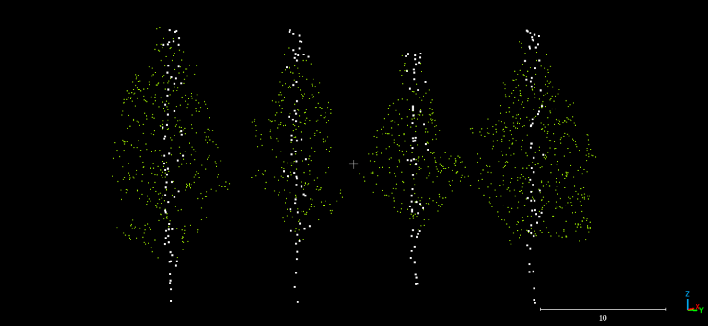
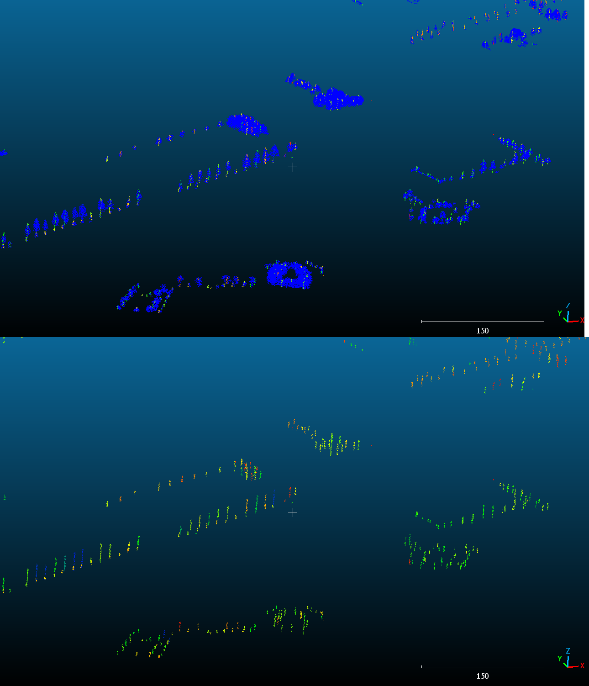
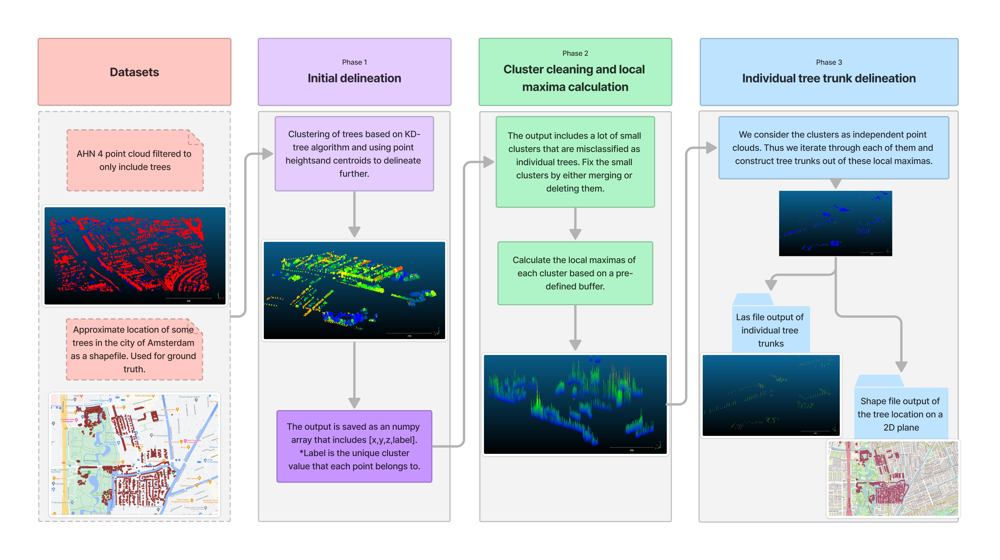
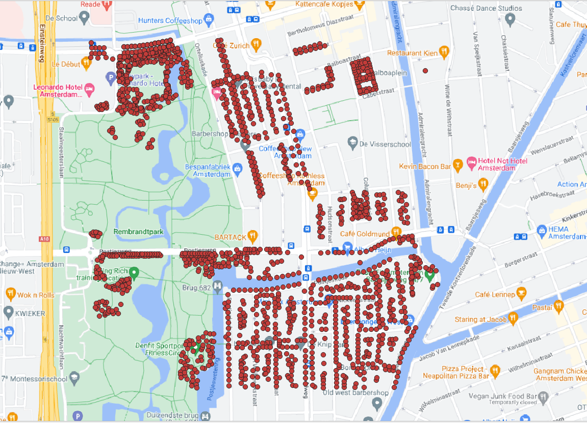
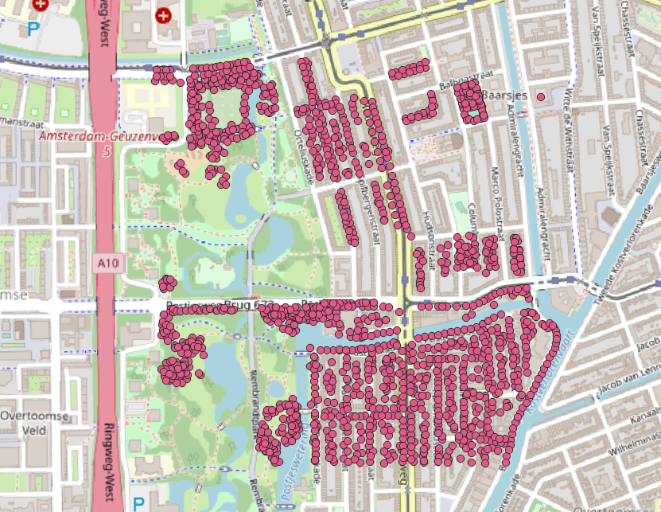

# Individual Tree Trunk Segmentation README
This repository contains the code to segment individual tree trunks out of an lidar point clouds that's already been filtered to contain only tree points.
The algorithm uses simple libraries and makes full use of the point cloud data structure to ensure speed and efficenty in caclulations.




Below it's the output of a sample dataset taken from the city of amsterdam:


---


## Project Folder Structure

The repository contains the full codes used and a sample data that can be used to test the code.


1) [`media`](./media/examples/): Images used in this repository
1) [`scripts`](./scripts): Folder with the full scripts of the tree trunks delineation code.
1) [`Sample_test`](Sample_test.las): This is a small las file that can be used to test the code and get and output.
1) [`Requirements`](requirements.txt): The version of the libraries used in the code
1) [`Project Report`](Project_Report.pdf): The version of the libraries used in the code

---
## Installation

1) Clone this repository:
    ```bash
    git clone https://github.com/Amsterdam-Internships/Tree-trunk-segmentation.git
    ```

---


## Parameters used in the code

1. The radius of the search spehere for the initial clustering.
2. The radius of the buffer on which we count the point density in x and y for each point (the parameter used for local maxima calculation).
3. The size of the search window for local maxima in each cluster.
4. The delineated trunks radius (visualized trunk).
5. The minimum eucledian distance that 2 peaks of the same cluster can have (else the peak won't be added).
6. The size of the small clusters we suspect as outliers (won't be deleted, they will just merge with a nearby big cluster if there is any, else they will be taken as individual clusters)
7. The minimal cluster size to be allowed as a tree. Deleting every cluster below this value (OPTIONAL!).


## How it works

Below is the simplified workflow that shows how the algorithm works and what logic it is built on:


---
## Ground Truth vs Code Output

The resulting output is converted into a 2D shapefile for improved visualization when comparing it to the ground truth.

The ground truth:




The algorithm output : 



---
## Accuracy assessment and Limitations

The method works around the diversity of trees and performs really well in densely packed clusters. As compared to using tree parameters, this method is more adaptable as it only suggests that the tree trunks have more points than any other section of the tree in a 2D plane.

The image below demonstrate the heterogeneous and unpredictable nature of tree diversity, which makes this method more reliable than using parameters.


Below is a manually checked cluster of trees that shows the accuraccy of our method. We expect this accuraccy to change by changing the parameters of the algorithm.
It is also neccessary to mention that there is some inconsistency with the point cloud data while compared to the ground truth, so our assessment is not completely accurate.


---
## Acknowledgements

This repository was created by [Jorges Nofulla](https://www.linkedin.com/in/jorges-nofulla-5a3139223/) in a collaboration with [Amsterdam Intelligence](https://www.amsterdamintelligence.com/) for the [City of Amsterdam](https://www.amsterdam.nl/).

I would like to express my sincere appreciation to my two internship supervisors, Daan Bloembergen and Nico de Graaff, as well as my university professors, Sander Oude Elberink and Michael Yang, for their invaluable guidance and support throughout the development of this project.Their extensive knowledge and experience in the field provided helped me to better understand the complexities of the project and achieve a successful outcome.

Our first part of the code, which clusters the trees is inspired by [Max-Hess](https://github.com/max-hess/GeometricNetworks) [](https://doi.org/10.5194/egusphere-egu21-4155 )

