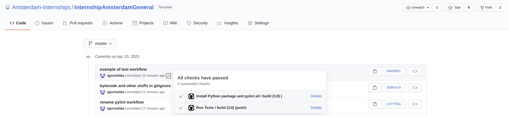
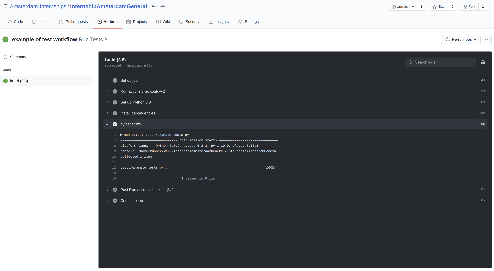
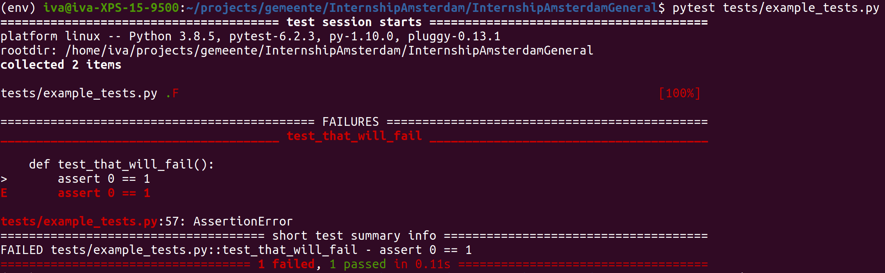

### Example of a test and a corresponding workflow
The tests will be executed every time you push thanks to the [`test workflow`](../.github/workflows/test_workflow.yml)

You can easily see whether your tests (or any other workflows) passed

---

And if things failed, or you just want to know more, you can always see 
the summary and more details about the individual steps of the corresponding workflow
(including the pytest output and the possibly failing assert statements)

---

If one or more of your tests are failing, the output would look more like this:

